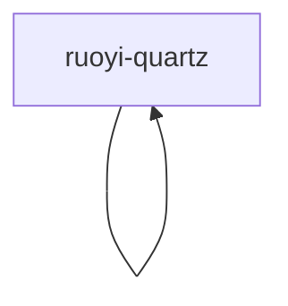

# 基础信息

|      |      |
|------|------|
| 编码语言 | .java |
| 代码路径 | ruoyi-quartz |
| 包名 | ruoyi-quartz |
| 概述说明 | JobInvokeUtil类解析调用方法，CronUtils处理Cron表达式，Quartz任务类管理定时任务，RyTask类处理多类型参数，SysJobController管理任务，SysJobLogController处理日志，SysJobServiceImpl和SysJobLogServiceImpl实现任务和日志管理，SysJobLog和SysJob类记录任务属性和日志。 |

# 说明

JobInvokeUtil类负责解析并调用目标方法及其参数，简化任务执行流程。CronUtils类处理Cron表达式，验证合法性并获取执行时间。抽象类处理Quartz任务，自动记录日志并包含异常处理机制。QuartzJobExecution类继承自AbstractQuartzJob，重写doExecute方法并调用JobInvokeUtil.invokeMethod。Quartz任务类确保任务不并发执行，通过调度器管理任务触发。ScheduleUtils类管理定时任务，提供任务创建和触发策略设置。RyTask类包含三个方法，分别处理多类型参数、字符串参数和无参数。SysJobController管理定时任务，提供查看、导出、删除、修改状态等功能。SysJobLogController处理调度日志相关操作，包括查看、导出、删除和清理。SysJobServiceImpl类管理定时任务，包括初始化、查询、暂停、恢复等功能。SysJobLogServiceImpl类提供日志查询、新增、删除和清空功能。SysJobLog类记录任务日志，包含ID、任务名、调用目标等属性。SysJob类用于任务管理，包含任务ID、名称、执行表达式等属性。

### 包内部结构视图

该流程图展示了`ruoyi-quartz`文件夹与其自身的关系。路径信息显示`ruoyi-quartz`文件夹包含一个同名的子文件夹，表明可能存在嵌套的文件夹结构。这种结构通常用于模块化或组织代码库，但在此例中，子文件夹与父文件夹同名，可能需要进一步检查以避免混淆或冗余。

# 文件列表 File List

| 名称   | 类型  | 说明 |
|-------|------|-------------|
| [ruoyi-quartz](ruoyi-quartz/src/main/java/com/_module.md) | module | JobInvokeUtil类解析调用方法，CronUtils处理Cron表达式，Quartz任务类管理定时任务，RyTask类处理多类型参数，SysJobController管理任务，SysJobLogController处理日志，SysJobServiceImpl和SysJobLogServiceImpl实现任务和日志管理，SysJobLog和SysJob类记录任务属性和日志。 |
| [ruoyi-quartz](ruoyi-quartz/src/main/java/com/_module.md) | module | JobInvokeUtil类解析调用方法，CronUtils处理Cron表达式，Quartz任务类管理定时任务，RyTask类处理多类型参数，SysJobController管理任务，SysJobLogController处理日志，SysJobServiceImpl和SysJobLogServiceImpl实现任务和日志管理，SysJobLog和SysJob类记录任务属性和日志。 |

