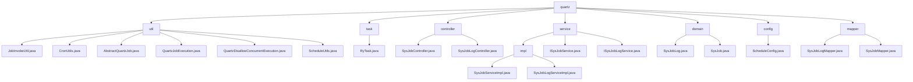

# 基础信息

|      |      |
|------|------|
| 编码语言 | .java |
| 代码路径 | ruoyi-quartz/ruoyi-quartz/src/main/java/com/ruoyi/quartz |
| 包名 | ruoyi-quartz.ruoyi-quartz.src.main.java.com.ruoyi.quartz |
| 概述说明 | JobInvokeUtil类解析调用方法，CronUtils处理Cron表达式，Quartz任务类管理定时任务，RyTask类处理多类型参数，SysJobController管理任务，SysJobLogController处理日志，SysJobServiceImpl和SysJobLogServiceImpl实现任务和日志管理，SysJobLog和SysJob类记录任务属性和日志。 |

# 说明

JobInvokeUtil类负责解析并调用目标方法及其参数，简化任务执行流程。CronUtils类处理Cron表达式，验证合法性并获取执行时间。抽象类处理Quartz任务，自动记录日志并包含异常处理机制。QuartzJobExecution类继承自AbstractQuartzJob，重写doExecute方法并调用JobInvokeUtil.invokeMethod。Quartz任务类确保任务不并发执行，通过调度器管理任务触发。ScheduleUtils类管理定时任务，提供任务创建和触发策略设置。RyTask类包含三个方法，分别处理多类型参数、字符串参数和无参数。SysJobController管理定时任务，提供查看、导出、删除、修改状态等功能。SysJobLogController处理调度日志相关操作，包括查看、导出、删除和清理。SysJobServiceImpl类管理定时任务，包括初始化、查询、暂停、恢复等功能。SysJobLogServiceImpl类提供日志查询、新增、删除和清空功能。SysJobLog类记录任务日志，包含ID、任务名、调用目标等属性。SysJob类用于任务管理，包含任务ID、名称、执行表达式等属性。

### 包内部结构视图

该流程图展示了`ruoyi-quartz`项目中的主要目录结构和文件关系。从`quartz`根目录出发，分别指向`util`、`task`、`controller`、`service`、`domain`、`config`和`mapper`等子目录。每个子目录下又包含多个具体的Java文件，这些文件分别实现了不同的功能模块，如任务调度、控制器、服务接口、领域模型、配置类和数据库映射等。

# 文件列表 File List

| 名称   | 类型  | 说明 |
|-------|------|-------------|
| [task](task/_module.md) | package | RyTask类含三个方法：ryMultipleParams处理多类型，ryParams处理字符串，ryNoParams无参数。 |
| [mapper](mapper/_module.md) | package | 输入内容为空，无法生成总结描述。请提供具体内容。 |
| [config](config/_module.md) | package | 信息为空，无法生成概要描述。 |
| [domain](domain/_module.md) | package | SysJobLog类记录任务日志，SysJob类管理任务，两类别均含ID、名称、组名、调用目标等关键属性。 |
| [service](service/_module.md) | package | SysJobServiceImpl管理定时任务，SysJobLogServiceImpl处理任务日志。 |
| [controller](controller/_module.md) | package | SysJobController管理定时任务，支持查看、导出、删除、修改、执行、新增和编辑任务。SysJobLogController处理调度日志，提供查看、导出、删除和清理功能。 |
| [util](util/_module.md) | package | JobInvokeUtil执行系统任务，CronUtils处理Cron表达式，Quartz任务类确保任务不并发，ScheduleUtils管理定时任务。 |
| [task](task/_module.md) | package | RyTask类含三个方法：ryMultipleParams处理多类型，ryParams处理字符串，ryNoParams无参数。 |
| [mapper](mapper/_module.md) | package | 输入内容为空，无法生成总结描述。请提供具体内容。 |
| [config](config/_module.md) | package | 信息为空，无法生成概要描述。 |
| [domain](domain/_module.md) | package | SysJobLog类记录任务日志，SysJob类管理任务，两类别均含ID、名称、组名、调用目标等关键属性。 |
| [service](service/_module.md) | package | SysJobServiceImpl管理定时任务，SysJobLogServiceImpl处理任务日志。 |
| [controller](controller/_module.md) | package | SysJobController管理定时任务，支持查看、导出、删除、修改、执行、新增和编辑任务。SysJobLogController处理调度日志，提供查看、导出、删除和清理功能。 |
| [util](util/_module.md) | package | JobInvokeUtil执行系统任务，CronUtils处理Cron表达式，Quartz任务类确保任务不并发，ScheduleUtils管理定时任务。 |

