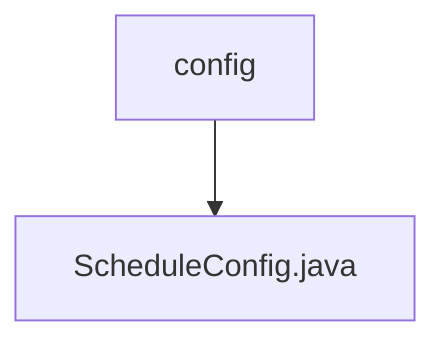

# 基础信息

|      |      |
|------|------|
| 编码语言 | .java |
| 代码路径 | ruoyi-quartz/ruoyi-quartz/src/main/java/com/ruoyi/quartz/config |
| 包名 | ruoyi-quartz.ruoyi-quartz.src.main.java.com.ruoyi.quartz.config |
| 概述说明 | 信息为空，无法生成概要描述。 |

# 说明

给定的内容为空，未提供任何具体信息或细节，因此无法进行总结描述。请提供具体内容以便进一步分析和撰写。

### 包内部结构视图

该流程图展示了 `ruoyi-quartz` 项目中 `config` 目录与 `ScheduleConfig.java` 文件之间的层级关系。`config` 是顶层目录，而 `ScheduleConfig.java` 是位于该目录下的配置文件。这种结构常用于组织和管理调度任务相关的配置信息。

# 文件列表 File List

| 名称   | 类型  | 说明 |
|-------|------|-------------|
| [ScheduleConfig.java](ScheduleConfig.md) | file | 信息为空，无法生成概要描述。 |
| [ScheduleConfig.java](ScheduleConfig.md) | file | 信息为空，无法生成概要描述。 |

