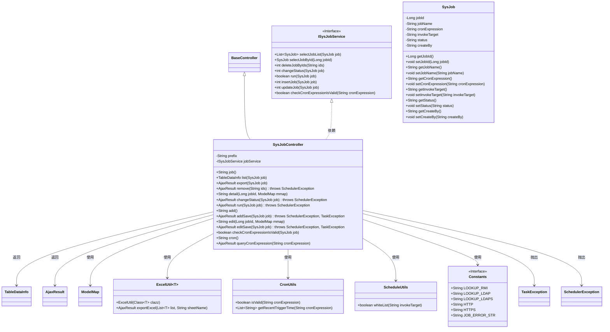

# 基础信息

|      |      |
|------|------|
| 编码语言 | .java |
| 代码路径 | ruoyi-quartz/ruoyi-quartz/src/main/java/com/ruoyi/quartz/controller/SysJobController.java |
| 包名 | com.ruoyi.quartz.controller |
| 依赖项 | ['java.util.List', 'org.apache.shiro.authz.annotation.RequiresPermissions', 'org.quartz.SchedulerException', 'org.springframework.beans.factory.annotation.Autowired', 'org.springframework.stereotype.Controller', 'org.springframework.ui.ModelMap', 'org.springframework.validation.annotation.Validated', 'org.springframework.web.bind.annotation.GetMapping', 'org.springframework.web.bind.annotation.PathVariable', 'org.springframework.web.bind.annotation.PostMapping', 'org.springframework.web.bind.annotation.RequestMapping', 'org.springframework.web.bind.annotation.RequestParam', 'org.springframework.web.bind.annotation.ResponseBody', 'com.ruoyi.common.annotation.Log', 'com.ruoyi.common.constant.Constants', 'com.ruoyi.common.core.controller.BaseController', 'com.ruoyi.common.core.domain.AjaxResult', 'com.ruoyi.common.core.page.TableDataInfo', 'com.ruoyi.common.enums.BusinessType', 'com.ruoyi.common.exception.job.TaskException', 'com.ruoyi.common.utils.StringUtils', 'com.ruoyi.common.utils.poi.ExcelUtil', 'com.ruoyi.quartz.domain.SysJob', 'com.ruoyi.quartz.service.ISysJobService', 'com.ruoyi.quartz.util.CronUtils', 'com.ruoyi.quartz.util.ScheduleUtils'] |
| 概述说明 | SysJobController负责定时任务的管理，涵盖列表、导出、删除、详情、状态修改、立即执行、新增和编辑等功能。 |

# 说明

SysJobController是一个用于管理定时任务的控制器，提供了多种功能以支持定时任务的全面管理。其主要功能包括：查看任务列表、导出任务数据、删除任务、查看任务详情、修改任务状态、立即执行任务、新增任务以及编辑任务。通过这些功能，用户可以方便地对系统中的定时任务进行配置、监控和操作，确保任务的正常运行和高效管理。

# 类列表 Class Summary

| 名称   | 类型  | 说明 |
|-------|------|-------------|
| SysJobController | class | SysJobController管理定时任务，包括列表、导出、删除、详情、状态修改、立即执行、新增、编辑等功能。 |

## 类 SysJobController

|      |      |
|------|------|
| 访问范围 | @Controller;@RequestMapping("/monitor/job");public |
| 类型 | class |
| 名称 | SysJobController |
| 说明 | SysJobController管理定时任务，包括列表、导出、删除、详情、状态修改、立即执行、新增、编辑等功能。 |

### UML类图

### 描述
`SysJobController` 是一个基于 Spring 框架的控制器类，继承自 `BaseController`，主要用于处理定时任务相关的请求。它依赖于 `ISysJobService` 接口来实现具体的业务逻辑，如任务的增删改查、状态修改、立即执行等。控制器还使用了多个工具类如 `ExcelUtil`、`CronUtils` 和 `ScheduleUtils` 来处理导出、Cron 表达式校验和白名单验证等操作。整个类图展示了控制器与各个组件之间的依赖关系及其功能划分。

### 内部方法调用关系图

```mermaid
graph TD
    A["类SysJobController"]
    B["属性: String prefix"]
    C["属性: ISysJobService jobService"]
    D["方法: job()"]
    E["方法: list(SysJob job)"]
    F["方法: export(SysJob job)"]
    G["方法: remove(String ids)"]
    H["方法: detail(Long jobId, ModelMap mmap)"]
    I["方法: changeStatus(SysJob job)"]
    J["方法: run(SysJob job)"]
    K["方法: add()"]
    L["方法: addSave(SysJob job)"]
    M["方法: edit(Long jobId, ModelMap mmap)"]
    N["方法: editSave(SysJob job)"]
    O["方法: checkCronExpressionIsValid(SysJob job)"]
    P["方法: cron()"]
    Q["方法: queryCronExpression(String cronExpression)"]

    A --> B
    A --> C
    A --> D
    A --> E
    A --> F
    A --> G
    A --> H
    A --> I
    A --> J
    A --> K
    A --> L
    A --> M
    A --> N
    A --> O
    A --> P
    A --> Q
```

这段代码定义了一个名为 `SysJobController` 的控制器类，用于处理与定时任务相关的请求。它包含了多个方法，分别用于处理任务列表查询、任务导出、任务删除、任务详情查看、任务状态修改、任务立即执行、任务新增与编辑等操作。每个方法都通过 `@GetMapping` 或 `@PostMapping` 注解映射到特定的 URL 路径，并通过 `@ResponseBody` 注解返回 JSON 格式的响应数据。代码中还使用了权限校验、日志记录等功能，确保系统的安全性和可追踪性。

### 字段列表 Field List

| 名称  | 类型  | 说明 |
|-------|-------|------|
| prefix = "monitor/job" | String | 私有字符串变量prefix被初始化为"monitor/job"。 |
| jobService | ISysJobService | 自动注入ISysJobService实例到jobService变量。 |

### 方法列表 Method List

| 名称  | 类型  | 说明 |
|-------|-------|------|
| checkCronExpressionIsValid | boolean | PostMapping方法检查Cron表达式有效性，返回布尔值。 |
| detail | String | 监控任务详情接口，通过任务ID获取详情并返回视图。 |
| edit | String | 需要权限"monitor:job:edit"，通过GET请求编辑指定ID的任务。 |
| job | String | 监控任务视图接口，返回指定路径。 |
| list | TableDataInfo | 监控任务列表接口，需权限，分页查询任务列表。 |
| addSave | AjaxResult | 新增定时任务接口，校验Cron表达式及目标字符串合法性，返回操作结果。 |
| changeStatus | AjaxResult | 定时任务状态变更接口，需权限，返回Ajax结果。 |
| run | AjaxResult | 定时任务执行接口，需权限，返回任务执行结果或错误信息。 |
| queryCronExpression | AjaxResult | GET请求校验并返回Cron表达式触发时间列表。 |
| add | String | 权限验证后，GET请求映射到/add路径，返回添加页面。 |
| remove | AjaxResult | 定时任务删除接口，需权限，接收ID参数，调用服务删除任务，返回成功结果。 |
| editSave | AjaxResult | 定时任务修改接口，校验Cron表达式及目标字符串合法性，返回操作结果。 |
| export | AjaxResult | 定时任务导出功能，需权限，返回Excel文件。 |
| cron | String | GetMapping注解映射"/cron"路径，返回前缀加"/cron"字符串。 |

