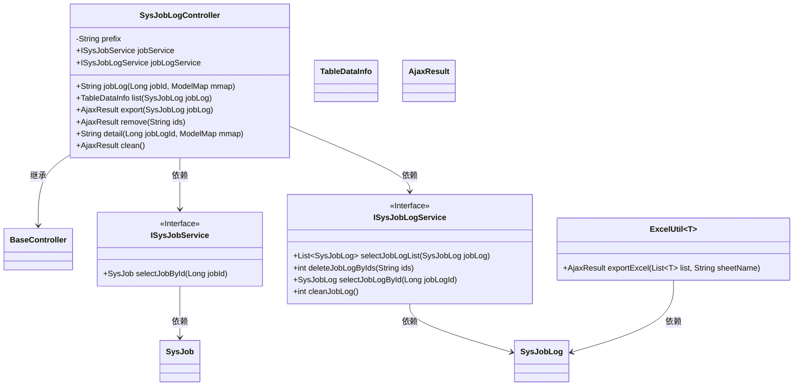

# 基础信息

|      |      |
|------|------|
| 编码语言 | .java |
| 代码路径 | ruoyi-quartz/ruoyi-quartz/src/main/java/com/ruoyi/quartz/controller/SysJobLogController.java |
| 包名 | com.ruoyi.quartz.controller |
| 依赖项 | ['java.util.List', 'org.apache.shiro.authz.annotation.RequiresPermissions', 'org.springframework.beans.factory.annotation.Autowired', 'org.springframework.stereotype.Controller', 'org.springframework.ui.ModelMap', 'org.springframework.web.bind.annotation.GetMapping', 'org.springframework.web.bind.annotation.PathVariable', 'org.springframework.web.bind.annotation.PostMapping', 'org.springframework.web.bind.annotation.RequestMapping', 'org.springframework.web.bind.annotation.RequestParam', 'org.springframework.web.bind.annotation.ResponseBody', 'com.ruoyi.common.annotation.Log', 'com.ruoyi.common.core.controller.BaseController', 'com.ruoyi.common.core.domain.AjaxResult', 'com.ruoyi.common.core.page.TableDataInfo', 'com.ruoyi.common.enums.BusinessType', 'com.ruoyi.common.utils.StringUtils', 'com.ruoyi.common.utils.poi.ExcelUtil', 'com.ruoyi.quartz.domain.SysJob', 'com.ruoyi.quartz.domain.SysJobLog', 'com.ruoyi.quartz.service.ISysJobLogService', 'com.ruoyi.quartz.service.ISysJobService'] |
| 概述说明 | SysJobLogController负责调度日志的查看、列表、导出、删除、详情和清理操作。 |

# 说明

SysJobLogController负责处理与调度日志相关的各项操作，包括查看日志详情、列出日志条目、导出日志数据、删除日志记录以及清理日志内容。该控制器提供了全面的功能，确保用户能够高效管理和维护调度日志，支持日志的详细查询、批量导出、选择性删除和定期清理，以满足系统日志管理的需求。

# 类列表 Class Summary

| 名称   | 类型  | 说明 |
|-------|------|-------------|
| SysJobLogController | class | SysJobLogController处理调度日志，包括查看、列表、导出、删除、详情和清理操作。 |

## 类 SysJobLogController

|      |      |
|------|------|
| 访问范围 | @Controller;@RequestMapping("/monitor/jobLog");public |
| 类型 | class |
| 名称 | SysJobLogController |
| 说明 | SysJobLogController处理调度日志，包括查看、列表、导出、删除、详情和清理操作。 |

### UML类图

### 描述
`SysJobLogController` 是一个基于 Spring MVC 的控制器，负责处理与调度日志相关的请求。它继承自 `BaseController`，并依赖 `ISysJobService` 和 `ISysJobLogService` 接口来获取和处理数据。控制器提供了多个方法，如 `jobLog` 用于查看日志，`list` 用于列出日志，`export` 用于导出日志，`remove` 用于删除日志，`detail` 用于查看日志详情，以及 `clean` 用于清理日志。这些方法通过 `@GetMapping` 和 `@PostMapping` 注解映射到不同的 URL 路径，并通过 `@ResponseBody` 返回 JSON 数据。

### 内部方法调用关系图

```mermaid
graph TD
    A["类SysJobLogController"]
    B["属性: String prefix"]
    C["属性: ISysJobService jobService"]
    D["属性: ISysJobLogService jobLogService"]
    E["方法: jobLog(Long jobId, ModelMap mmap)"]
    F["方法: list(SysJobLog jobLog)"]
    G["方法: export(SysJobLog jobLog)"]
    H["方法: remove(String ids)"]
    I["方法: detail(Long jobLogId, ModelMap mmap)"]
    J["方法: clean()"]

    A --> B
    A --> C
    A --> D
    A --> E
    A --> F
    A --> G
    A --> H
    A --> I
    A --> J

    E -->|"if (StringUtils.isNotNull(jobId))"| K["jobService.selectJobById(jobId)"]
    E -->|"mmap.put('job', job)"| L["返回prefix + '/jobLog'"]
    F -->|"startPage()"| M["jobLogService.selectJobLogList(jobLog)"]
    F -->|"getDataTable(list)"| N["返回TableDataInfo"]
    G -->|"jobLogService.selectJobLogList(jobLog)"| O["ExcelUtil.exportExcel(list, '调度日志')"]
    G -->|"返回AjaxResult"| P["返回AjaxResult"]
    H -->|"jobLogService.deleteJobLogByIds(ids)"| Q["toAjax(result)"]
    H -->|"返回AjaxResult"| R["返回AjaxResult"]
    I -->|"mmap.put('name', 'jobLog')"| S["jobLogService.selectJobLogById(jobLogId)"]
    I -->|"返回prefix + '/detail'"| T["返回prefix + '/detail'"]
    J -->|"jobLogService.cleanJobLog()"| U["success()"]
    J -->|"返回AjaxResult"| V["返回AjaxResult"]
```

这段代码是一个Spring MVC控制器类，名为`SysJobLogController`，用于处理与调度日志相关的请求。它包含多个方法，分别用于处理日志的查看、列表展示、导出、删除、详情查看和清理操作。每个方法都通过`@RequiresPermissions`注解进行权限控制，并通过`@Autowired`注入的服务类来处理具体的业务逻辑。代码通过`ModelMap`传递数据到视图层，并通过`@ResponseBody`返回JSON格式的响应数据。

### 字段列表 Field List

| 名称  | 类型  | 说明 |
|-------|-------|------|
| prefix = "monitor/job" | String | 定义私有字符串变量prefix，值为"monitor/job"。 |
| jobLogService | ISysJobLogService | 自动注入任务日志服务实例。 |
| jobService | ISysJobService | 自动注入系统任务服务实例。 |

### 方法列表 Method List

| 名称  | 类型  | 说明 |
|-------|-------|------|
| list | TableDataInfo | 监控任务日志列表查询接口，需权限，返回分页数据。 |
| clean | AjaxResult | 调度日志清理接口，需监控权限，调用清理服务后返回成功。 |
| export | AjaxResult | 导出调度日志，需权限验证，返回Excel文件。 |
| jobLog | String | 查看任务日志，根据任务ID获取任务信息并返回日志页面。 |
| remove | AjaxResult | 删除调度日志接口，需权限验证，返回删除结果。 |
| detail | String | 查看作业日志详情接口，需权限，路径含日志ID。 |

