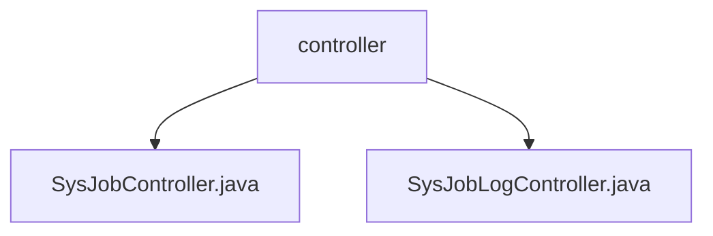

# 基础信息

|      |      |
|------|------|
| 编码语言 | .java |
| 代码路径 | ruoyi-quartz/ruoyi-quartz/src/main/java/com/ruoyi/quartz/controller |
| 包名 | ruoyi-quartz.ruoyi-quartz.src.main.java.com.ruoyi.quartz.controller |
| 概述说明 | SysJobController管理定时任务，支持查看、导出、删除、修改、执行、新增和编辑任务。SysJobLogController处理调度日志，提供查看、导出、删除和清理功能。 |

# 说明

SysJobController是一个管理定时任务的控制器，提供查看任务列表、导出任务数据、删除任务、查看任务详情、修改任务状态、立即执行任务、新增任务和编辑任务等功能，方便用户配置、监控和操作系统中的定时任务。SysJobLogController负责处理调度日志相关操作，包括查看日志详情、列出日志条目、导出日志数据、删除日志记录和清理日志内容，确保用户能高效管理和维护调度日志，支持详细查询、批量导出、选择性删除和定期清理。

### 包内部结构视图

该流程图展示了`ruoyi-quartz`项目中`controller`目录下的两个Java文件：`SysJobController.java`和`SysJobLogController.java`。这两个文件均位于`controller`目录下，表明它们属于同一层级，且都用于处理与任务调度相关的控制器逻辑。

# 文件列表 File List

| 名称   | 类型  | 说明 |
|-------|------|-------------|
| [SysJobLogController.java](SysJobLogController.md) | file | SysJobLogController负责调度日志的查看、列表、导出、删除、详情和清理操作。 |
| [SysJobController.java](SysJobController.md) | file | SysJobController负责定时任务的管理，涵盖列表、导出、删除、详情、状态修改、立即执行、新增和编辑等功能。 |
| [SysJobLogController.java](SysJobLogController.md) | file | SysJobLogController负责调度日志的查看、列表、导出、删除、详情和清理操作。 |
| [SysJobController.java](SysJobController.md) | file | SysJobController负责定时任务的管理，涵盖列表、导出、删除、详情、状态修改、立即执行、新增和编辑等功能。 |

