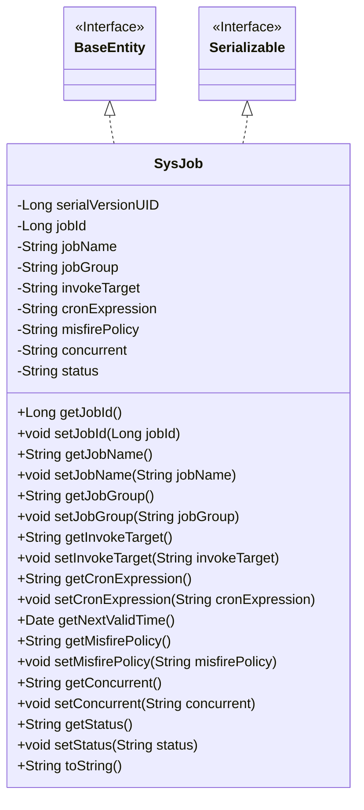

# 基础信息

|      |      |
|------|------|
| 编码语言 | .java |
| 代码路径 | ruoyi-quartz/ruoyi-quartz/src/main/java/com/ruoyi/quartz/domain/SysJob.java |
| 包名 | com.ruoyi.quartz.domain |
| 依赖项 | ['java.io.Serializable', 'java.util.Date', 'javax.validation.constraints', 'org.apache.commons.lang3.builder.ToStringBuilder', 'org.apache.commons.lang3.builder.ToStringStyle', 'com.ruoyi.common.annotation.Excel', 'com.ruoyi.common.annotation.Excel.ColumnType', 'com.ruoyi.common.constant.ScheduleConstants', 'com.ruoyi.common.core.domain.BaseEntity', 'com.ruoyi.common.utils.StringUtils', 'com.ruoyi.quartz.util.CronUtils'] |
| 概述说明 | SysJob类管理任务，包含ID、名称、组名、调用目标、表达式、策略、并发和状态属性。 |

# 说明

SysJob类用于实现任务管理，包含多个关键属性。任务ID用于唯一标识每个任务。任务名称和组名分别描述任务的名称和所属组别。调用目标指定任务执行的具体方法或函数。执行表达式定义了任务的执行时间或触发条件。计划策略决定任务的调度方式。并发执行属性控制任务是否可以同时运行。状态属性记录任务的当前运行状态，如启用或禁用。这些属性共同构成了任务管理的核心功能。

# 类列表 Class Summary

| 名称   | 类型  | 说明 |
|-------|------|-------------|
| SysJob | class | SysJob类实现任务管理，包含任务ID、名称、组名、调用目标、执行表达式、计划策略、并发执行和状态等属性。 |

## 类 SysJob

|      |      |
|------|------|
| 访问范围 | public |
| 类型 | class |
| 名称 | SysJob |
| 说明 | SysJob类实现任务管理，包含任务ID、名称、组名、调用目标、执行表达式、计划策略、并发执行和状态等属性。 |

### UML类图

### 描述
`SysJob`类是一个用于管理任务信息的实体类，继承自`BaseEntity`并实现了`Serializable`接口。它包含了任务的基本属性，如任务ID、任务名称、任务组名、调用目标字符串、Cron执行表达式等，并提供了相应的getter和setter方法。`SysJob`类还包含一个`getNextValidTime`方法，用于获取下一个有效的执行时间。通过`toString`方法，可以将任务信息以字符串形式输出。该类主要用于任务调度和管理系统中，确保任务的各项属性能够被正确设置和获取。

### 内部方法调用关系图

```mermaid
graph TD
    A["类SysJob"]
    B["属性: Long jobId"]
    C["属性: String jobName"]
    D["属性: String jobGroup"]
    E["属性: String invokeTarget"]
    F["属性: String cronExpression"]
    G["属性: String misfirePolicy"]
    H["属性: String concurrent"]
    I["属性: String status"]
    J["方法: Long getJobId()"]
    K["方法: void setJobId(Long jobId)"]
    L["方法: String getJobName()"]
    M["方法: void setJobName(String jobName)"]
    N["方法: String getJobGroup()"]
    O["方法: void setJobGroup(String jobGroup)"]
    P["方法: String getInvokeTarget()"]
    Q["方法: void setInvokeTarget(String invokeTarget)"]
    R["方法: String getCronExpression()"]
    S["方法: void setCronExpression(String cronExpression)"]
    T["方法: Date getNextValidTime()"]
    U["方法: String getMisfirePolicy()"]
    V["方法: void setMisfirePolicy(String misfirePolicy)"]
    W["方法: String getConcurrent()"]
    X["方法: void setConcurrent(String concurrent)"]
    Y["方法: String getStatus()"]
    Z["方法: void setStatus(String status)"]
    AA["重写方法: String toString()"]

    A --> B
    A --> C
    A --> D
    A --> E
    A --> F
    A --> G
    A --> H
    A --> I
    A --> J
    A --> K
    A --> L
    A --> M
    A --> N
    A --> O
    A --> P
    A --> Q
    A --> R
    A --> S
    A --> T
    A --> U
    A --> V
    A --> W
    A --> X
    A --> Y
    A --> Z
    A -.-> AA
```

该流程图展示了`SysJob`类的结构及其内部属性和方法的关系。`SysJob`类继承自`BaseEntity`并实现了`Serializable`接口，包含多个属性如`jobId`、`jobName`、`jobGroup`等，以及对应的`getter`和`setter`方法。`toString`方法被重写以返回对象的字符串表示。流程图清晰地展示了类内部的函数调用关系和属性映射，帮助理解类的整体设计。

### 字段列表 Field List

| 名称  | 类型  | 说明 |
|-------|-------|------|
| jobName | String | Excel任务名称字段定义为jobName。 |
| status | String | 任务状态字段，0表示正常，1表示暂停。 |
| invokeTarget | String | Excel调用目标字符串变量声明。 |
| serialVersionUID = 1L | long | 声明一个静态不可变的序列化版本标识符。 |
| cronExpression | String | Excel中定义了一个名为cronExpression的私有字符串变量。 |
| jobGroup | String | Excel任务组名属性定义为私有字符串类型。 |
| concurrent | String | Excel字段"并发执行"允许值为0，禁止值为1。 |
| jobId | Long | Excel列名为“任务序号”，数据类型为长整型，字段名为jobId。 |
| misfirePolicy = ScheduleConstants.MISFIRE_DEFAULT | String | 计划策略：0默认，1立即执行，2执行一次，3不立即执行。 |

### 方法列表 Method List

| 名称  | 类型  | 说明 |
|-------|-------|------|
| getJobName | String | 任务名称不能为空且不超过64个字符。 |
| setConcurrent | void | 设置并发属性值为指定字符串。 |
| setMisfirePolicy | void | 设置任务调度失败处理策略的方法。 |
| setInvokeTarget | void | 设置调用目标方法，参数为字符串invokeTarget。 |
| getMisfirePolicy | String | 获取任务调度失败处理策略的方法。 |
| setJobGroup | void | 设置任务组名称的方法。 |
| setCronExpression | void | 设置定时任务表达式的方法。 |
| setStatus | void | 设置对象状态的方法，接受字符串参数。 |
| getStatus | String | 获取当前状态的方法。 |
| setJobName | void | 设置工作名称的方法，将输入值赋给类变量。 |
| getInvokeTarget | String | 方法返回调用目标字符串，长度限制为0到1000字符，不能为空。 |
| toString | String | 重写toString方法，输出多行格式的作业信息。 |
| getCronExpression | String | Cron表达式校验：非空且长度不超过255字符。 |
| getJobGroup | String | 获取任务组名的方法。 |
| getNextValidTime | Date | 该方法根据cron表达式返回下一次有效执行时间，若表达式为空则返回null。 |
| getConcurrent | String | 获取并发状态的字符串方法。 |
| getJobId | Long | 获取任务ID的方法，返回长整型jobId。 |
| setJobId | void | 设置jobId属性的方法。 |

