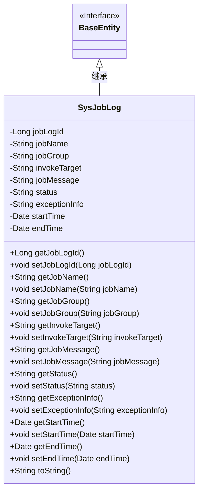

# 基础信息

|      |      |
|------|------|
| 编码语言 | .java |
| 代码路径 | ruoyi-quartz/ruoyi-quartz/src/main/java/com/ruoyi/quartz/domain/SysJobLog.java |
| 包名 | com.ruoyi.quartz.domain |
| 依赖项 | ['java.util.Date', 'org.apache.commons.lang3.builder.ToStringBuilder', 'org.apache.commons.lang3.builder.ToStringStyle', 'com.ruoyi.common.annotation.Excel', 'com.ruoyi.common.core.domain.BaseEntity'] |
| 概述说明 | SysJobLog类记录任务日志，包含ID、任务名、组名、目标、日志、状态、异常及时间。 |

# 说明

SysJobLog类用于记录任务日志，包含多个关键属性：ID用于唯一标识每条日志，任务名和组名分别标识任务的名称和所属组，调用目标指明任务的具体执行目标，日志信息记录任务执行过程中的详细信息，状态表示任务的执行结果，异常信息记录任务执行过程中出现的异常情况，起止时间分别记录任务的开始和结束时间。这些属性共同构成了任务日志的完整记录，便于后续查询和分析。

# 类列表 Class Summary

| 名称   | 类型  | 说明 |
|-------|------|-------------|
| SysJobLog | class | SysJobLog类记录任务日志，包含ID、任务名、组名、调用目标、日志信息、状态、异常信息及起止时间。 |

## 类 SysJobLog

|      |      |
|------|------|
| 访问范围 | public |
| 类型 | class |
| 名称 | SysJobLog |
| 说明 | SysJobLog类记录任务日志，包含ID、任务名、组名、调用目标、日志信息、状态、异常信息及起止时间。 |

### UML类图

这段代码定义了一个`SysJobLog`类，该类继承自`BaseEntity`接口。`SysJobLog`类包含多个私有属性，如`jobLogId`、`jobName`、`jobGroup`等，并提供了相应的getter和setter方法。此外，该类还重写了`toString`方法，用于返回对象的字符串表示形式。类图展示了`SysJobLog`类与`BaseEntity`接口之间的继承关系，以及`SysJobLog`类内部的属性和方法。

### 内部方法调用关系图

```mermaid
graph TD
    A["类SysJobLog"]
    B["属性: Long jobLogId"]
    C["属性: String jobName"]
    D["属性: String jobGroup"]
    E["属性: String invokeTarget"]
    F["属性: String jobMessage"]
    G["属性: String status"]
    H["属性: String exceptionInfo"]
    I["属性: Date startTime"]
    J["属性: Date endTime"]
    K["方法: Long getJobLogId()"]
    L["方法: void setJobLogId(Long jobLogId)"]
    M["方法: String getJobName()"]
    N["方法: void setJobName(String jobName)"]
    O["方法: String getJobGroup()"]
    P["方法: void setJobGroup(String jobGroup)"]
    Q["方法: String getInvokeTarget()"]
    R["方法: void setInvokeTarget(String invokeTarget)"]
    S["方法: String getJobMessage()"]
    T["方法: void setJobMessage(String jobMessage)"]
    U["方法: String getStatus()"]
    V["方法: void setStatus(String status)"]
    W["方法: String getExceptionInfo()"]
    X["方法: void setExceptionInfo(String exceptionInfo)"]
    Y["方法: Date getStartTime()"]
    Z["方法: void setStartTime(Date startTime)"]
    AA["方法: Date getEndTime()"]
    AB["方法: void setEndTime(Date endTime)"]
    AC["重写方法: String toString()"]

    A --> B
    A --> C
    A --> D
    A --> E
    A --> F
    A --> G
    A --> H
    A --> I
    A --> J
    A --> K
    A --> L
    A --> M
    A --> N
    A --> O
    A --> P
    A --> Q
    A --> R
    A --> S
    A --> T
    A --> U
    A --> V
    A --> W
    A --> X
    A --> Y
    A --> Z
    A --> AA
    A --> AB
    A --> AC
```

该流程图展示了`SysJobLog`类的结构和内部方法调用关系。`SysJobLog`类继承自`BaseEntity`，包含多个属性和对应的`getter`和`setter`方法。`toString`方法被重写以返回对象的字符串表示。每个属性和方法都通过箭头与类进行连接，清晰地展示了类内部的结构和功能。

### 字段列表 Field List

| 名称  | 类型  | 说明 |
|-------|-------|------|
| serialVersionUID = 1L | long | 定义序列化版本号的静态常量，值为1L。 |
| endTime | Date | 私有日期类型变量endTime。 |
| startTime | Date | 定义了私有日期类型变量startTime。 |
| jobGroup | String | 任务组名属性定义为私有字符串类型。 |
| jobName | String | Excel任务名称字段定义为私有字符串类型。 |
| status | String | Excel字段“执行状态”映射为0正常，1失败。 |
| jobMessage | String | Excel日志信息存储于jobMessage字段。 |
| invokeTarget | String | Excel调用目标字符串的私有变量invokeTarget。 |
| exceptionInfo | String | Excel异常信息字段定义为私有字符串类型。 |
| jobLogId | Long | 日志序号定义为长整型私有变量。 |

### 方法列表 Method List

| 名称  | 类型  | 说明 |
|-------|-------|------|
| setStatus | void | 设置对象状态的方法，接受字符串参数。 |
| getStatus | String | 获取状态值的方法。 |
| getJobName | String | 获取jobName的方法，返回jobName字符串。 |
| getExceptionInfo | String | 获取异常信息的方法。 |
| getJobLogId | Long | 获取任务日志ID的方法。 |
| getInvokeTarget | String | 获取调用目标的方法。 |
| setInvokeTarget | void | 方法setInvokeTarget用于设置invokeTarget的值。 |
| setJobLogId | void | 设置任务日志ID的方法。 |
| getStartTime | Date | 该方法返回对象的起始时间。 |
| getJobGroup | String | 获取任务组的方法，返回任务组变量。 |
| setJobGroup | void | 设置任务组的方法，将输入参数赋值给类成员变量jobGroup。 |
| setExceptionInfo | void | 设置异常信息的方法，将输入参数赋值给成员变量exceptionInfo。 |
| getJobMessage | String | 该方法返回jobMessage字符串。 |
| setStartTime | void | 设置开始时间的方法，接受日期类型参数。 |
| setJobName | void | 设置类中jobName属性的方法。 |
| setEndTime | void | 设置结束时间的方法，参数为Date类型。 |
| getEndTime | Date | 方法getEndTime返回endTime值。 |
| toString | String | 重写toString方法，多行格式输出任务日志信息。 |
| setJobMessage | void | 设置任务消息的方法，将传入的jobMessage赋值给类成员变量。 |

