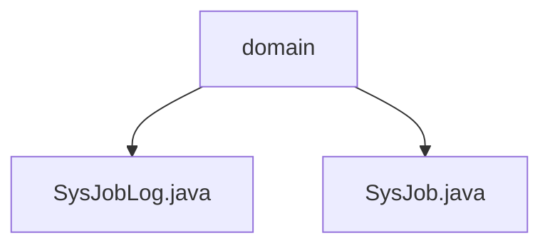

# 基础信息

|      |      |
|------|------|
| 编码语言 | .java |
| 代码路径 | ruoyi-quartz/ruoyi-quartz/src/main/java/com/ruoyi/quartz/domain |
| 包名 | ruoyi-quartz.ruoyi-quartz.src.main.java.com.ruoyi.quartz.domain |
| 概述说明 | SysJobLog类记录任务日志，SysJob类管理任务，两类别均含ID、名称、组名、调用目标等关键属性。 |

# 说明

SysJobLog类用于记录任务日志，包含ID、任务名、组名、调用目标、日志信息、状态、异常信息、起止时间等属性，这些属性共同构成任务日志的完整记录，便于查询和分析。SysJob类用于任务管理，包含任务ID、任务名称、组名、调用目标、执行表达式、计划策略、并发执行、状态等属性，这些属性共同构成任务管理的核心功能，支持任务的调度、执行和状态管理。

### 包内部结构视图

流程图展示了 `ruoyi-quartz` 项目中 `domain` 文件夹下的两个文件 `SysJobLog.java` 和 `SysJob.java` 的层级关系。`domain` 是根节点，直接包含这两个文件，表示它们在项目中的结构位置。

# 文件列表 File List

| 名称   | 类型  | 说明 |
|-------|------|-------------|
| [SysJob.java](SysJob.md) | file | SysJob类管理任务，包含ID、名称、组名、调用目标、表达式、策略、并发和状态属性。 |
| [SysJobLog.java](SysJobLog.md) | file | SysJobLog类记录任务日志，包含ID、任务名、组名、目标、日志、状态、异常及时间。 |
| [SysJob.java](SysJob.md) | file | SysJob类管理任务，包含ID、名称、组名、调用目标、表达式、策略、并发和状态属性。 |
| [SysJobLog.java](SysJobLog.md) | file | SysJobLog类记录任务日志，包含ID、任务名、组名、目标、日志、状态、异常及时间。 |

