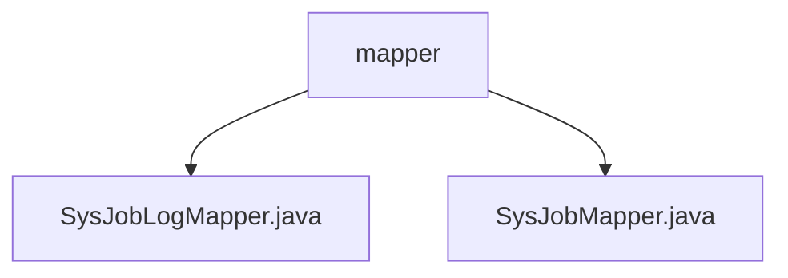

# 基础信息

|      |      |
|------|------|
| 编码语言 | .java |
| 代码路径 | ruoyi-quartz/ruoyi-quartz/src/main/java/com/ruoyi/quartz/mapper |
| 包名 | ruoyi-quartz.ruoyi-quartz.src.main.java.com.ruoyi.quartz.mapper |
| 概述说明 | 输入内容为空，无法生成总结描述。请提供具体内容。 |

# 说明

由于给定的内容为空，无法提供具体的总结描述。请提供相关内容以便进行详细的描述和总结。由于提供的输入内容为空，无法进行总结描述。请提供具体内容以便生成相应的描述。

### 包内部结构视图

该流程图展示了`ruoyi-quartz`项目中`mapper`文件夹与其内部文件之间的层级关系。`mapper`文件夹包含两个文件：`SysJobLogMapper.java`和`SysJobMapper.java`。这两个文件均直接隶属于`mapper`文件夹，没有进一步的子文件夹或嵌套结构。

# 文件列表 File List

| 名称   | 类型  | 说明 |
|-------|------|-------------|
| [SysJobMapper.java](SysJobMapper.md) | file | 无内容可总结。 |
| [SysJobLogMapper.java](SysJobLogMapper.md) | file | 无内容，无法生成概要描述。 |
| [SysJobMapper.java](SysJobMapper.md) | file | 无内容可总结。 |
| [SysJobLogMapper.java](SysJobLogMapper.md) | file | 无内容，无法生成概要描述。 |

