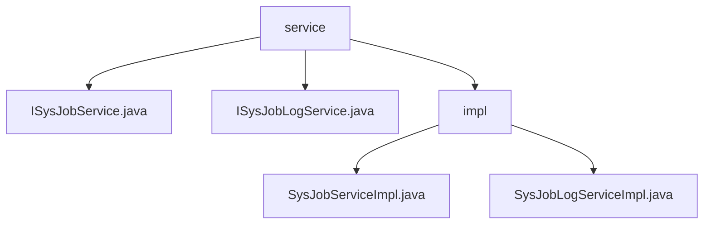

# 基础信息

|      |      |
|------|------|
| 编码语言 | .java |
| 代码路径 | ruoyi-quartz/ruoyi-quartz/src/main/java/com/ruoyi/quartz/service |
| 包名 | ruoyi-quartz.ruoyi-quartz.src.main.java.com.ruoyi.quartz.service |
| 概述说明 | SysJobServiceImpl管理定时任务，SysJobLogServiceImpl处理任务日志。 |

# 说明

SysJobServiceImpl类实现了ISysJobService接口，负责管理定时任务，包括初始化、查询、暂停、恢复、删除、状态修改、运行、新增、更新及Cron表达式校验等功能，确保任务的高效管理和执行。SysJobLogServiceImpl类实现了ISysJobLogService接口，提供日志查询、新增、删除和清空功能，处理系统任务日志相关操作，确保日志数据的完整性和可追溯性。这两个类共同保障了系统任务的稳定运行和日志的完整记录。

### 包内部结构视图

该流程图展示了`ruoyi-quartz`项目中`service`模块的层级关系。`service`目录下包含两个接口文件`ISysJobService.java`和`ISysJobLogService.java`，以及一个`impl`子目录。`impl`子目录中包含了两个实现类文件`SysJobServiceImpl.java`和`SysJobLogServiceImpl.java`，分别对应上述接口的实现。

# 文件列表 File List

| 名称   | 类型  | 说明 |
|-------|------|-------------|
| [ISysJobLogService.java](ISysJobLogService.md) | file | 无内容提供，无法生成概要描述。 |
| [ISysJobService.java](ISysJobService.md) | file | 信息为空，无法生成概要描述。 |
| [impl](impl/_module.md) | package | SysJobServiceImpl管理定时任务，SysJobLogServiceImpl处理任务日志。 |
| [ISysJobLogService.java](ISysJobLogService.md) | file | 无内容提供，无法生成概要描述。 |
| [ISysJobService.java](ISysJobService.md) | file | 信息为空，无法生成概要描述。 |
| [impl](impl/_module.md) | package | SysJobServiceImpl管理定时任务，SysJobLogServiceImpl处理任务日志。 |

