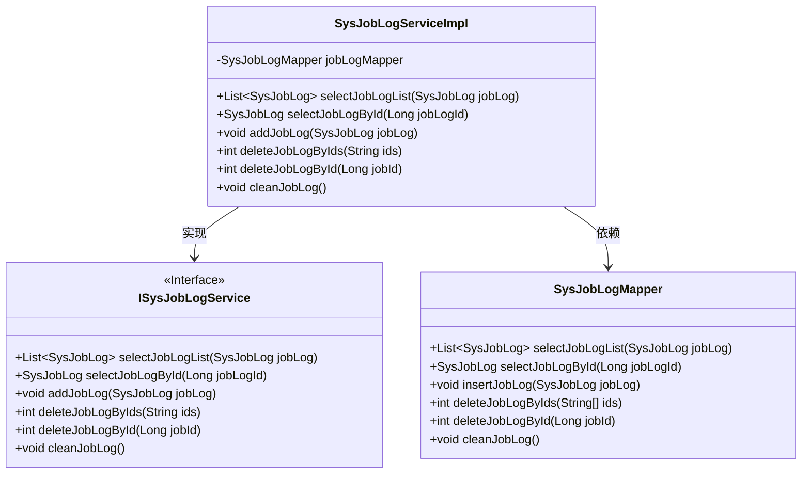
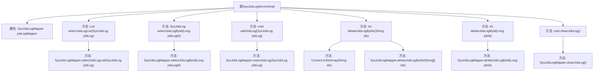

# 基础信息

|      |      |
|------|------|
| 编码语言 | .java |
| 代码路径 | ruoyi-quartz/ruoyi-quartz/src/main/java/com/ruoyi/quartz/service/impl/SysJobLogServiceImpl.java |
| 包名 | com.ruoyi.quartz.service.impl |
| 依赖项 | ['java.util.List', 'org.springframework.beans.factory.annotation.Autowired', 'org.springframework.stereotype.Service', 'com.ruoyi.common.core.text.Convert', 'com.ruoyi.quartz.domain.SysJobLog', 'com.ruoyi.quartz.mapper.SysJobLogMapper', 'com.ruoyi.quartz.service.ISysJobLogService'] |
| 概述说明 | SysJobLogServiceImpl实现ISysJobLogService，提供日志查询、新增、删除和清空功能。 |

# 说明

SysJobLogServiceImpl实现了ISysJobLogService接口，提供了日志查询、新增、删除和清空的功能。该服务类主要负责处理系统任务日志的相关操作，包括查询日志记录、新增日志条目、删除指定日志以及清空所有日志数据。通过这些功能，SysJobLogServiceImpl能够有效地管理和维护系统任务日志，确保日志数据的完整性和可追溯性。

# 类列表 Class Summary

| 名称   | 类型  | 说明 |
|-------|------|-------------|
| SysJobLogServiceImpl | class | SysJobLogServiceImpl实现ISysJobLogService，提供日志查询、新增、删除和清空功能。 |

## 类 SysJobLogServiceImpl

|      |      |
|------|------|
| 访问范围 | @Service;public |
| 类型 | class |
| 名称 | SysJobLogServiceImpl |
| 说明 | SysJobLogServiceImpl实现ISysJobLogService，提供日志查询、新增、删除和清空功能。 |

### UML类图

这段代码描述了一个调度任务日志服务实现类 `SysJobLogServiceImpl`，它实现了 `ISysJobLogService` 接口，并通过 `SysJobLogMapper` 进行数据访问。`SysJobLogServiceImpl` 提供了多种操作调度任务日志的方法，包括查询、新增、删除和清空日志等。`ISysJobLogService` 接口定义了这些操作的标准，而 `SysJobLogMapper` 则负责与数据库交互，执行具体的SQL操作。

### 内部方法调用关系图

这段代码是`SysJobLogServiceImpl`类的实现，主要用于管理和操作调度任务日志。它通过`SysJobLogMapper`与数据库进行交互，提供了查询、新增、删除和清空日志的功能。每个方法都调用了`SysJobLogMapper`的相应方法来完成具体的数据库操作。

### 字段列表 Field List

| 名称  | 类型  | 说明 |
|-------|-------|------|
| jobLogMapper | SysJobLogMapper | 自动注入SysJobLogMapper实例。 |

### 方法列表 Method List

| 名称  | 类型  | 说明 |
|-------|-------|------|
| selectJobLogById | SysJobLog | 通过ID查询系统任务日志的方法。 |
| selectJobLogList | List<SysJobLog> | 重写方法selectJobLogList，调用jobLogMapper查询日志列表。 |
| cleanJobLog | void | 重写cleanJobLog方法，调用jobLogMapper清理日志。 |
| deleteJobLogByIds | int | 重写方法，通过ID删除任务日志并返回结果。 |
| deleteJobLogById | int | 删除指定ID的作业日志并返回结果。 |
| addJobLog | void | 重写addJobLog方法，调用jobLogMapper插入日志。 |

