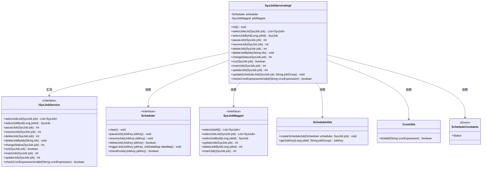

# 基础信息

|      |      |
|------|------|
| 编码语言 | .java |
| 代码路径 | ruoyi-quartz/ruoyi-quartz/src/main/java/com/ruoyi/quartz/service/impl/SysJobServiceImpl.java |
| 包名 | com.ruoyi.quartz.service.impl |
| 依赖项 | ['java.util.List', 'javax.annotation.PostConstruct', 'org.quartz.JobDataMap', 'org.quartz.JobKey', 'org.quartz.Scheduler', 'org.quartz.SchedulerException', 'org.springframework.beans.factory.annotation.Autowired', 'org.springframework.stereotype.Service', 'org.springframework.transaction.annotation.Transactional', 'com.ruoyi.common.constant.ScheduleConstants', 'com.ruoyi.common.core.text.Convert', 'com.ruoyi.common.exception.job.TaskException', 'com.ruoyi.quartz.domain.SysJob', 'com.ruoyi.quartz.mapper.SysJobMapper', 'com.ruoyi.quartz.service.ISysJobService', 'com.ruoyi.quartz.util.CronUtils', 'com.ruoyi.quartz.util.ScheduleUtils'] |
| 概述说明 | SysJobServiceImpl类实现ISysJobService接口，管理定时任务的各项操作。 |

# 说明

SysJobServiceImpl类实现了ISysJobService接口，主要负责定时任务的管理。其功能包括定时任务的初始化、查询、暂停、恢复、删除、状态修改、运行、新增、更新以及Cron表达式的校验等。该类全面涵盖了定时任务的各项操作，确保任务的高效管理和执行。

# 类列表 Class Summary

| 名称   | 类型  | 说明 |
|-------|------|-------------|
| SysJobServiceImpl | class | SysJobServiceImpl类实现ISysJobService接口，负责定时任务管理，包括初始化、查询、暂停、恢复、删除、修改状态、运行、新增、更新和校验Cron表达式等功能。 |

## 类 SysJobServiceImpl

|      |      |
|------|------|
| 访问范围 | @Service;public |
| 类型 | class |
| 名称 | SysJobServiceImpl |
| 说明 | SysJobServiceImpl类实现ISysJobService接口，负责定时任务管理，包括初始化、查询、暂停、恢复、删除、修改状态、运行、新增、更新和校验Cron表达式等功能。 |

### UML类图

### 描述
`SysJobServiceImpl` 类实现了 `ISysJobService` 接口，负责管理定时任务的生命周期。它依赖于 `Scheduler` 接口来调度任务，依赖于 `SysJobMapper` 接口来访问数据库中的任务信息。`ScheduleUtils` 和 `CronUtils` 提供了工具方法，`ScheduleConstants` 包含了任务状态的枚举。该类通过 `init` 方法在项目启动时初始化定时任务，并提供了任务的增删改查、暂停、恢复、立即运行等功能。

### 内部方法调用关系图

```mermaid
graph TD
    A["类SysJobServiceImpl"]
    B["属性: Scheduler scheduler"]
    C["属性: SysJobMapper jobMapper"]
    D["方法: init()"]
    E["方法: selectJobList(SysJob job)"]
    F["方法: selectJobById(Long jobId)"]
    G["方法: pauseJob(SysJob job)"]
    H["方法: resumeJob(SysJob job)"]
    I["方法: deleteJob(SysJob job)"]
    J["方法: deleteJobByIds(String ids)"]
    K["方法: changeStatus(SysJob job)"]
    L["方法: run(SysJob job)"]
    M["方法: insertJob(SysJob job)"]
    N["方法: updateJob(SysJob job)"]
    O["方法: updateSchedulerJob(SysJob job, String jobGroup)"]
    P["方法: checkCronExpressionIsValid(String cronExpression)"]

    A --> B
    A --> C
    A --> D
    A --> E
    A --> F
    A --> G
    A --> H
    A --> I
    A --> J
    A --> K
    A --> L
    A --> M
    A --> N
    A --> O
    A --> P
```

这段代码是一个Spring服务类`SysJobServiceImpl`，用于管理和调度定时任务。它通过`Scheduler`和`SysJobMapper`与任务调度器和数据库进行交互。主要功能包括初始化定时器、查询任务列表、暂停、恢复、删除任务、修改任务状态、立即运行任务、新增任务、更新任务以及校验Cron表达式的有效性。代码通过注解`@PostConstruct`在项目启动时初始化定时器，确保任务与数据库同步。

### 字段列表 Field List

| 名称  | 类型  | 说明 |
|-------|-------|------|
| scheduler | Scheduler | 自动注入调度器实例。 |
| jobMapper | SysJobMapper | 使用Autowired自动注入SysJobMapper实例。 |

### 方法列表 Method List

| 名称  | 类型  | 说明 |
|-------|-------|------|
| deleteJobByIds | void | 方法删除指定ID的作业，支持事务回滚。 |
| selectJobById | SysJob | 重写方法，通过ID查询系统任务。 |
| selectJobList | List<SysJob> | 重写方法，调用jobMapper查询任务列表并返回。 |
| resumeJob | int | 恢复任务状态并更新调度器，返回更新行数。 |
| deleteJob | int | 该方法删除任务并处理异常，成功时移除调度器中的任务。 |
| updateSchedulerJob | void | 更新调度任务，先检查存在则删除再创建。 |
| checkCronExpressionIsValid | boolean | 方法验证Cron表达式是否有效。 |
| insertJob | int | 插入任务并创建调度，状态设为暂停，返回插入行数。 |
| updateJob | int | 更新任务方法，含事务回滚，调用更新调度任务。 |
| init | void | 初始化方法，清空调度器并创建所有任务。 |
| changeStatus | int | 根据任务状态更改任务状态，支持恢复和暂停操作。 |
| run | boolean | 该方法检查并触发指定任务，成功返回true，失败返回false。 |
| pauseJob | int | 暂停任务方法，更新任务状态并暂停调度器中的任务。 |

