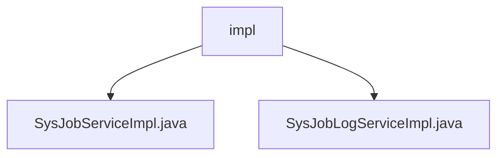

# 基础信息

|      |      |
|------|------|
| 编码语言 | .java |
| 代码路径 | ruoyi-quartz/ruoyi-quartz/src/main/java/com/ruoyi/quartz/service/impl |
| 包名 | ruoyi-quartz.ruoyi-quartz.src.main.java.com.ruoyi.quartz.service.impl |
| 概述说明 | SysJobServiceImpl管理定时任务，SysJobLogServiceImpl处理任务日志。 |

# 说明

SysJobServiceImpl类实现了ISysJobService接口，负责定时任务的管理，涵盖初始化、查询、暂停、恢复、删除、状态修改、运行、新增、更新及Cron表达式校验等功能，确保任务高效管理和执行。SysJobLogServiceImpl类实现了ISysJobLogService接口，提供日志查询、新增、删除和清空功能，处理系统任务日志相关操作，确保日志数据完整性和可追溯性。

### 包内部结构视图

该流程图展示了 `ruoyi-quartz` 项目中 `impl` 文件夹下的两个服务实现类：`SysJobServiceImpl.java` 和 `SysJobLogServiceImpl.java`。`impl` 是这两个类的父级目录，它们分别实现了不同的服务逻辑，用于处理定时任务和任务日志的相关功能。

# 文件列表 File List

| 名称   | 类型  | 说明 |
|-------|------|-------------|
| [SysJobLogServiceImpl.java](SysJobLogServiceImpl.md) | file | SysJobLogServiceImpl实现ISysJobLogService，提供日志查询、新增、删除和清空功能。 |
| [SysJobServiceImpl.java](SysJobServiceImpl.md) | file | SysJobServiceImpl类实现ISysJobService接口，管理定时任务的各项操作。 |
| [SysJobLogServiceImpl.java](SysJobLogServiceImpl.md) | file | SysJobLogServiceImpl实现ISysJobLogService，提供日志查询、新增、删除和清空功能。 |
| [SysJobServiceImpl.java](SysJobServiceImpl.md) | file | SysJobServiceImpl类实现ISysJobService接口，管理定时任务的各项操作。 |

