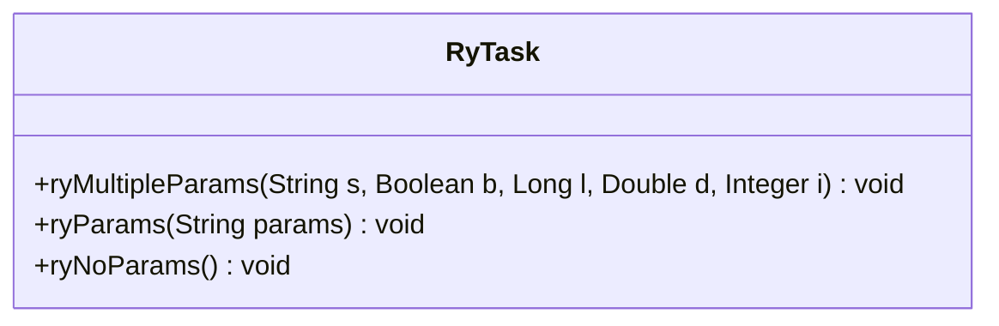
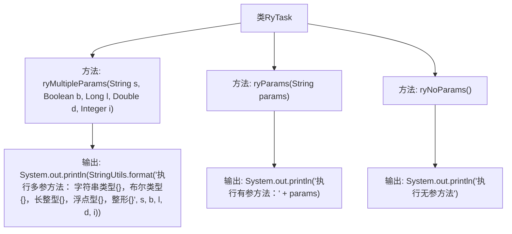

# 基础信息

|      |      |
|------|------|
| 编码语言 | .java |
| 代码路径 | ruoyi-quartz/ruoyi-quartz/src/main/java/com/ruoyi/quartz/task/RyTask.java |
| 包名 | com.ruoyi.quartz.task |
| 依赖项 | ['org.springframework.stereotype.Component', 'com.ruoyi.common.utils.StringUtils'] |
| 概述说明 | RyTask类含三个方法：ryMultipleParams处理多类型，ryParams处理字符串，ryNoParams无参数。 |

# 说明

RyTask类是一个包含三个方法的类。ryMultipleParams方法用于处理多类型参数，ryParams方法专门处理字符串参数，而ryNoParams方法则是一个无参数的方法。这三个方法分别针对不同的参数需求，提供了灵活的功能实现。

# 类列表 Class Summary

| 名称   | 类型  | 说明 |
|-------|------|-------------|
| RyTask | class | RyTask类包含三个方法：ryMultipleParams处理多类型参数，ryParams处理字符串参数，ryNoParams无参数。 |

## 类 RyTask

|      |      |
|------|------|
| 访问范围 | @Component("ryTask");public |
| 类型 | class |
| 名称 | RyTask |
| 说明 | RyTask类包含三个方法：ryMultipleParams处理多类型参数，ryParams处理字符串参数，ryNoParams无参数。 |

### UML类图

**描述：**  
`RyTask` 类是一个简单的任务执行类，包含三个方法：`ryMultipleParams`、`ryParams` 和 `ryNoParams`。`ryMultipleParams` 方法接收多个不同类型的参数并打印格式化字符串；`ryParams` 方法接收一个字符串参数并打印；`ryNoParams` 方法无参数，仅打印固定信息。该类展示了如何处理不同参数类型和无参数的方法调用。

### 内部方法调用关系图

这段代码定义了一个名为`RyTask`的类，其中包含三个方法：`ryMultipleParams`、`ryParams`和`ryNoParams`。`ryMultipleParams`方法接收多个不同类型的参数，并使用`StringUtils.format`方法格式化输出。`ryParams`方法接收一个字符串参数并直接输出。`ryNoParams`方法不接收任何参数，仅输出一条固定信息。流程图展示了类与各个方法之间的关系，以及每个方法内部的输出步骤。

### 字段列表 Field List

| 名称  | 类型  | 说明 |
|-------|-------|------|

### 方法列表 Method List

| 名称  | 类型  | 说明 |
|-------|-------|------|
| ryMultipleParams | void | 多参方法打印字符串、布尔、长整型、浮点型和整型参数。 |
| ryNoParams | void | 定义一个无参方法，执行时输出"执行无参方法"。 |
| ryParams | void | 定义了一个公共方法ryParams，接受字符串参数并输出执行信息。 |

