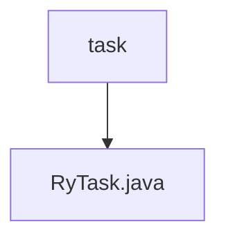

# 基础信息

|      |      |
|------|------|
| 编码语言 | .java |
| 代码路径 | ruoyi-quartz/ruoyi-quartz/src/main/java/com/ruoyi/quartz/task |
| 包名 | ruoyi-quartz.ruoyi-quartz.src.main.java.com.ruoyi.quartz.task |
| 概述说明 | RyTask类含三个方法：ryMultipleParams处理多类型，ryParams处理字符串，ryNoParams无参数。 |

# 说明

RyTask类是一个包含三个方法的类。ryMultipleParams方法用于处理多类型参数，ryParams方法专门处理字符串参数，而ryNoParams方法则是一个无参数的方法。这三个方法分别针对不同的参数需求，提供了灵活的功能实现。

### 包内部结构视图

流程图描述：该流程图展示了路径的层级关系，`task`文件夹包含一个文件`RyTask.java`。图中清晰地表示了`task`作为父节点，`RyTask.java`作为子节点的结构，简洁明了地反映了文件与文件夹之间的从属关系。

# 文件列表 File List

| 名称   | 类型  | 说明 |
|-------|------|-------------|
| [RyTask.java](RyTask.md) | file | RyTask类含三个方法：ryMultipleParams处理多类型，ryParams处理字符串，ryNoParams无参数。 |
| [RyTask.java](RyTask.md) | file | RyTask类含三个方法：ryMultipleParams处理多类型，ryParams处理字符串，ryNoParams无参数。 |

