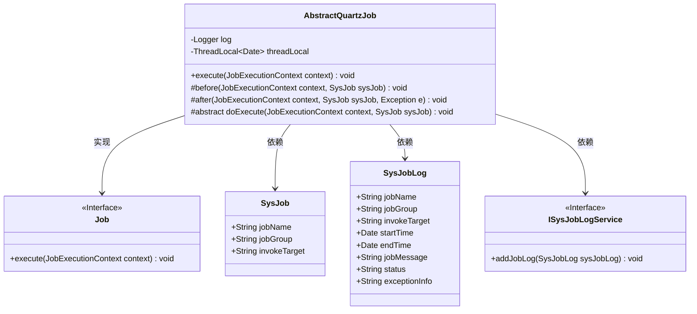
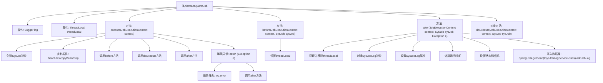

# 基础信息

|      |      |
|------|------|
| 编码语言 | .java |
| 代码路径 | ruoyi-quartz/ruoyi-quartz/src/main/java/com/ruoyi/quartz/util/AbstractQuartzJob.java |
| 包名 | com.ruoyi.quartz.util |
| 依赖项 | ['java.util.Date', 'org.quartz.Job', 'org.quartz.JobExecutionContext', 'org.slf4j.Logger', 'org.slf4j.LoggerFactory', 'com.ruoyi.common.constant.Constants', 'com.ruoyi.common.constant.ScheduleConstants', 'com.ruoyi.common.utils.ExceptionUtil', 'com.ruoyi.common.utils.StringUtils', 'com.ruoyi.common.utils.bean.BeanUtils', 'com.ruoyi.common.utils.spring.SpringUtils', 'com.ruoyi.quartz.domain.SysJob', 'com.ruoyi.quartz.domain.SysJobLog', 'com.ruoyi.quartz.service.ISysJobLogService'] |
| 概述说明 | 抽象类实现Quartz任务，含执行前后日志及异常处理。 |

# 说明

该内容描述了一个抽象类的实现，主要用于处理Quartz任务。该抽象类在执行任务前后会自动记录日志，确保任务执行的透明性和可追踪性。同时，它还包含了异常处理机制，能够在任务执行过程中捕获并处理异常，保证系统的稳定性和可靠性。这种设计使得任务执行过程更加可控，便于监控和调试。

# 类列表 Class Summary

| 名称   | 类型  | 说明 |
|-------|------|-------------|
| AbstractQuartzJob | class | 抽象类实现Quartz任务，包含执行前后日志记录和异常处理。 |

## 类 AbstractQuartzJob

|      |      |
|------|------|
| 访问范围 | public abstract |
| 类型 | class |
| 名称 | AbstractQuartzJob |
| 说明 | 抽象类实现Quartz任务，包含执行前后日志记录和异常处理。 |

### UML类图

**描述：**
`AbstractQuartzJob` 是一个抽象类，实现了 `Job` 接口，用于处理定时任务的执行。它通过 `execute` 方法调用任务的执行流程，并在执行前后分别调用 `before` 和 `after` 方法进行预处理和后处理。`doExecute` 方法由子类重载，用于具体任务的执行。`after` 方法中会记录任务日志，并通过 `ISysJobLogService` 接口将日志写入数据库。

### 内部方法调用关系图

这段代码定义了一个抽象类 `AbstractQuartzJob`，主要用于执行定时任务。代码中包含了一个 `execute` 方法，负责任务执行的流程，包括任务执行前的准备、任务执行本身以及执行后的处理。`before` 方法用于在执行任务前设置线程本地变量，`after` 方法用于在执行任务后记录日志并写入数据库。`doExecute` 方法是一个抽象方法，需要由子类实现具体的任务逻辑。代码还处理了任务执行过程中可能出现的异常，并记录异常信息。

### 字段列表 Field List

| 名称  | 类型  | 说明 |
|-------|-------|------|
| log = LoggerFactory.getLogger(AbstractQuartzJob.class) | Logger | AbstractQuartzJob类中定义了一个私有的静态日志记录器。 |
| threadLocal = new ThreadLocal<>() | ThreadLocal<Date> | 定义线程局部变量，存储日期对象。 |

### 方法列表 Method List

| 名称  | 类型  | 说明 |
|-------|-------|------|
| doExecute | void | 保护抽象方法，执行任务时抛出异常。 |
| execute | void | 重写execute方法，执行任务前后处理异常并记录日志。 |
| before | void | 在JobExecutionContext和SysJob执行前，将当前日期存入threadLocal。 |
| after | void | 记录任务执行日志，包含名称、组、目标、时间及状态，异常时记录错误信息，最后存入数据库。 |

