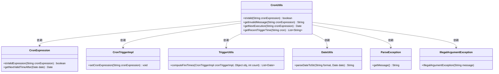
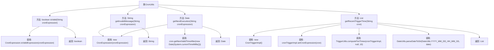

# 基础信息

|      |      |
|------|------|
| 编码语言 | .java |
| 代码路径 | ruoyi-quartz/ruoyi-quartz/src/main/java/com/ruoyi/quartz/util/CronUtils.java |
| 包名 | com.ruoyi.quartz.util |
| 依赖项 | ['java.text.ParseException', 'java.util.ArrayList', 'java.util.Date', 'java.util.List', 'org.quartz.CronExpression', 'org.quartz.TriggerUtils', 'org.quartz.impl.triggers.CronTriggerImpl', 'com.ruoyi.common.utils.DateUtils'] |
| 概述说明 | CronUtils类支持Cron表达式验证、错误处理及执行时间查询。 |

# 说明

CronUtils类是一个用于处理Cron表达式的工具类，提供了多项实用功能。首先，它能够验证Cron表达式的合法性，确保其格式正确。其次，当表达式存在错误时，该类可以获取详细的错误信息，帮助用户快速定位问题。此外，CronUtils类还支持查询Cron表达式对应的下次执行时间，方便用户了解任务的触发时间。更为重要的是，该类能够查询并返回Cron表达式近10次的执行时间，为用户提供全面的执行计划信息。这些功能使得CronUtils类在处理定时任务时非常实用和高效。

# 类列表 Class Summary

| 名称   | 类型  | 说明 |
|-------|------|-------------|
| CronUtils | class | CronUtils类提供Cron表达式验证、错误信息获取、下次执行时间及近10次执行时间查询功能。 |

## 类 CronUtils

|      |      |
|------|------|
| 访问范围 | public |
| 类型 | class |
| 名称 | CronUtils |
| 说明 | CronUtils类提供Cron表达式验证、错误信息获取、下次执行时间及近10次执行时间查询功能。 |

### UML类图

**描述：**  
`CronUtils` 类提供了与Cron表达式相关的实用方法，包括验证表达式有效性、获取无效信息、获取下次执行时间以及获取最近10次执行时间。该类依赖于 `CronExpression`、`CronTriggerImpl`、`TriggerUtils`、`DateUtils` 等类来实现这些功能，并处理可能的 `ParseException` 和 `IllegalArgumentException` 异常。

### 内部方法调用关系图

这段代码定义了一个名为`CronUtils`的类，提供了四个静态方法来处理Cron表达式。`isValid`方法用于验证Cron表达式的有效性，`getInvalidMessage`方法返回无效Cron表达式的错误信息，`getNextExecution`方法返回Cron表达式的下一个执行时间，`getRecentTriggerTime`方法返回Cron表达式近10次的执行时间。每个方法都通过调用不同的内部类和方法来实现其功能，流程图清晰地展示了这些方法之间的调用关系和返回结果。

### 字段列表 Field List

| 名称  | 类型  | 说明 |
|-------|-------|------|

### 方法列表 Method List

| 名称  | 类型  | 说明 |
|-------|-------|------|
| getInvalidMessage | String | 该方法验证cron表达式，无效时返回错误信息，有效时返回null。 |
| getRecentTriggerTime | List<String> | 该方法根据cron表达式获取最近10次触发时间并返回字符串列表。 |
| isValid | boolean | 静态方法验证cron表达式是否有效。 |
| getNextExecution | Date | 根据cron表达式获取下一次执行时间，异常时抛出非法参数异常。 |

