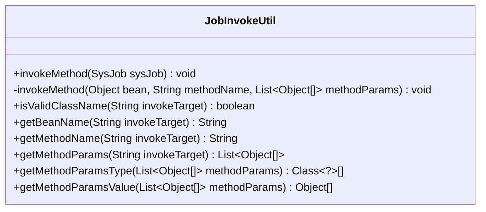
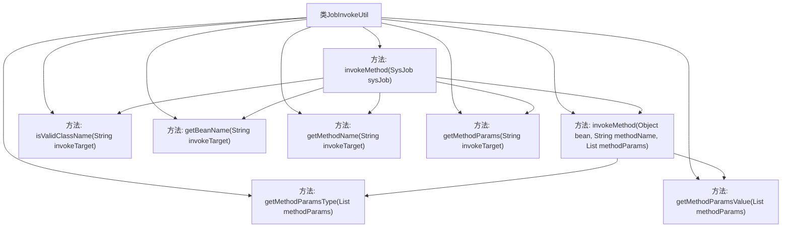

# 基础信息

|      |      |
|------|------|
| 编码语言 | .java |
| 代码路径 | ruoyi-quartz/ruoyi-quartz/src/main/java/com/ruoyi/quartz/util/JobInvokeUtil.java |
| 包名 | com.ruoyi.quartz.util |
| 依赖项 | ['java.lang.reflect.InvocationTargetException', 'java.lang.reflect.Method', 'java.util.LinkedList', 'java.util.List', 'com.ruoyi.common.utils.StringUtils', 'com.ruoyi.common.utils.spring.SpringUtils', 'com.ruoyi.quartz.domain.SysJob'] |
| 概述说明 | JobInvokeUtil类用于执行系统任务并调用目标方法及参数。 |

# 说明

JobInvokeUtil类的主要功能是执行系统任务，具体包括解析目标方法及其参数，并进行调用。该类负责处理与任务执行相关的逻辑，确保方法能够正确被调用并传入相应的参数，从而完成系统任务。其核心作用在于简化任务执行流程，提高系统操作的效率和准确性。

# 类列表 Class Summary

| 名称   | 类型  | 说明 |
|-------|------|-------------|
| JobInvokeUtil | class | JobInvokeUtil类用于执行系统任务，解析并调用目标方法及参数。 |

## 类 JobInvokeUtil

|      |      |
|------|------|
| 访问范围 | public |
| 类型 | class |
| 名称 | JobInvokeUtil |
| 说明 | JobInvokeUtil类用于执行系统任务，解析并调用目标方法及参数。 |

### UML类图

该代码定义了一个名为 `JobInvokeUtil` 的工具类，用于执行系统任务中的方法调用。类中包含多个静态方法，主要用于解析任务目标字符串、获取方法参数、校验类名、以及执行方法调用。`invokeMethod` 方法根据任务目标字符串动态调用相应的方法，支持从Spring容器中获取Bean或通过反射实例化对象。其他辅助方法用于解析参数类型和值，确保方法调用的正确性。

### 内部方法调用关系图

这段代码定义了一个`JobInvokeUtil`类，主要用于动态调用系统任务中的方法。`invokeMethod`方法根据传入的系统任务对象，解析出目标Bean、方法名和参数列表，然后根据Bean名称是否合法，决定是从Spring容器中获取Bean还是通过反射实例化Bean，最后调用目标方法。其他辅助方法用于解析Bean名称、方法名、参数类型和参数值，确保方法调用的正确性和灵活性。

### 字段列表 Field List

| 名称  | 类型  | 说明 |
|-------|-------|------|

### 方法列表 Method List

| 名称  | 类型  | 说明 |
|-------|-------|------|
| getBeanName | String | 提取方法名前的类名作为Bean名称。 |
| getMethodParamsType | Class<?>[] | 获取方法参数类型列表的静态函数。 |
| getMethodParamsValue | Object[] | 提取方法参数列表中的首个元素并返回新数组。 |
| invokeMethod | void | 通过反射调用指定对象的方法，支持带参数和无参数情况。 |
| invokeMethod | void | 根据SysJob对象调用指定Bean的方法，支持Spring容器和类实例化。 |
| getMethodName | String | 提取方法名：从调用目标中获取方法名。 |
| getMethodParams | List<Object[]> | 提取方法参数并分类为字符串、布尔、长整型、浮点型和整型。 |
| isValidClassName | boolean | 该方法检查字符串中点的数量是否大于1，判断是否为有效类名。 |

