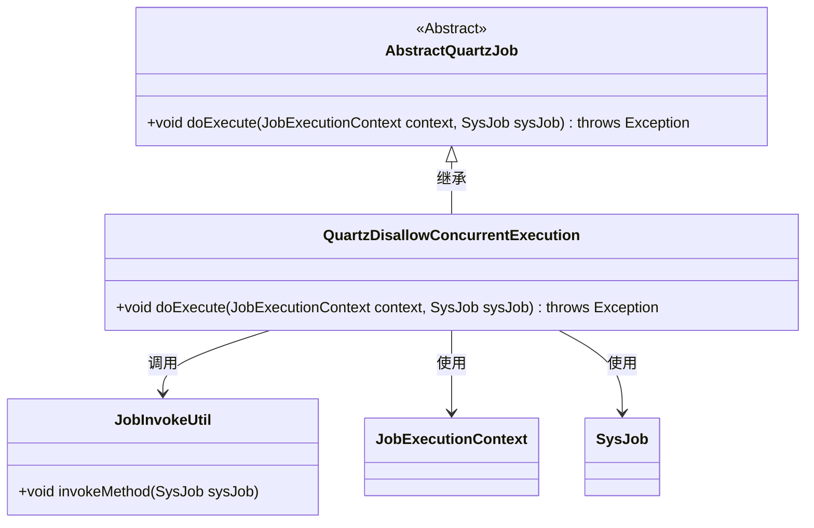
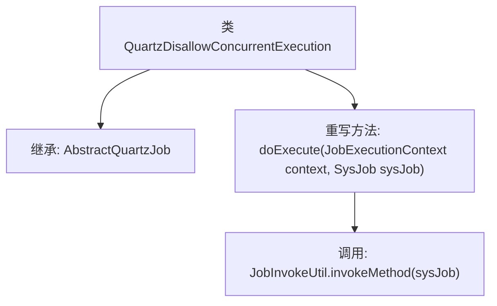

# 基础信息

|      |      |
|------|------|
| 编码语言 | .java |
| 代码路径 | ruoyi-quartz/ruoyi-quartz/src/main/java/com/ruoyi/quartz/util/QuartzDisallowConcurrentExecution.java |
| 包名 | com.ruoyi.quartz.util |
| 依赖项 | ['org.quartz.DisallowConcurrentExecution', 'org.quartz.JobExecutionContext', 'com.ruoyi.quartz.domain.SysJob'] |
| 概述说明 | Quartz任务类禁止并发执行，调用指定方法。 |

# 说明

Quartz任务类设计用于确保任务不会并发执行，其主要功能是调用指定的方法。该任务类通过配置和调度，确保在同一时间只有一个实例运行，避免多线程并发带来的问题。任务的具体执行逻辑封装在指定方法中，通过Quartz调度器进行管理和触发。这种设计适用于需要严格控制任务执行顺序和避免资源冲突的场景。

# 类列表 Class Summary

| 名称   | 类型  | 说明 |
|-------|------|-------------|
| QuartzDisallowConcurrentExecution | class | Quartz任务类，禁止并发执行，调用指定方法。 |

## 类 QuartzDisallowConcurrentExecution

|      |      |
|------|------|
| 访问范围 | @DisallowConcurrentExecution;public |
| 类型 | class |
| 名称 | QuartzDisallowConcurrentExecution |
| 说明 | Quartz任务类，禁止并发执行，调用指定方法。 |

### UML类图

这段代码定义了一个 `QuartzDisallowConcurrentExecution` 类，它继承自 `AbstractQuartzJob` 抽象类，并重写了 `doExecute` 方法。在 `doExecute` 方法中，调用了 `JobInvokeUtil` 的 `invokeMethod` 方法来执行任务。`QuartzDisallowConcurrentExecution` 类依赖于 `JobExecutionContext` 和 `SysJob` 类来传递上下文信息和任务数据。整体结构展示了任务执行的流程，以及类之间的依赖关系。

### 内部方法调用关系图

该流程图描述了`QuartzDisallowConcurrentExecution`类的结构及其方法调用关系。该类继承自`AbstractQuartzJob`，并重写了`doExecute`方法。在`doExecute`方法中，调用了`JobInvokeUtil.invokeMethod`来执行具体的任务逻辑。该流程展示了从类定义到方法调用的完整路径，清晰地反映了代码的执行流程。

### 字段列表 Field List

| 名称  | 类型  | 说明 |
|-------|-------|------|

### 方法列表 Method List

| 名称  | 类型  | 说明 |
|-------|-------|------|
| doExecute | void | 重写doExecute方法，调用JobInvokeUtil执行sysJob任务。 |

