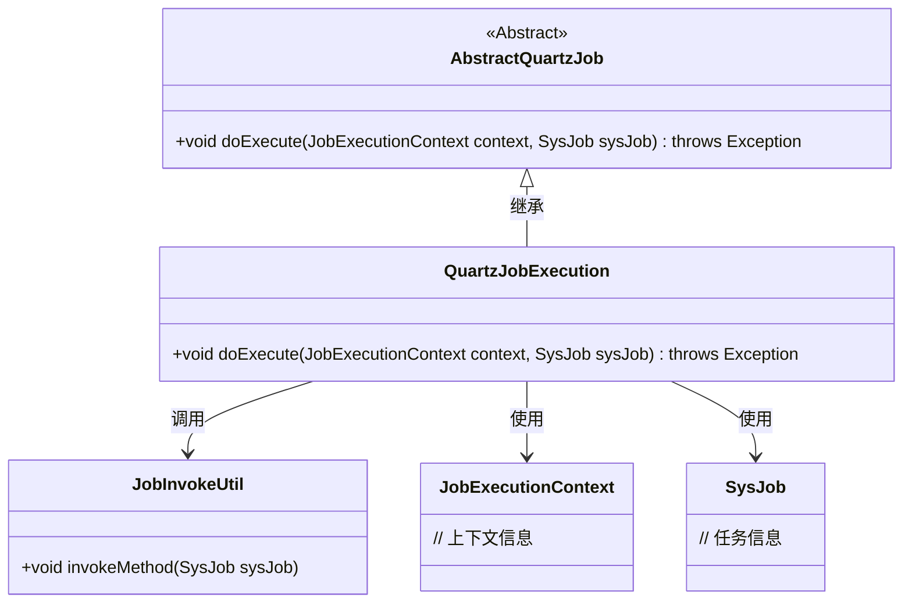
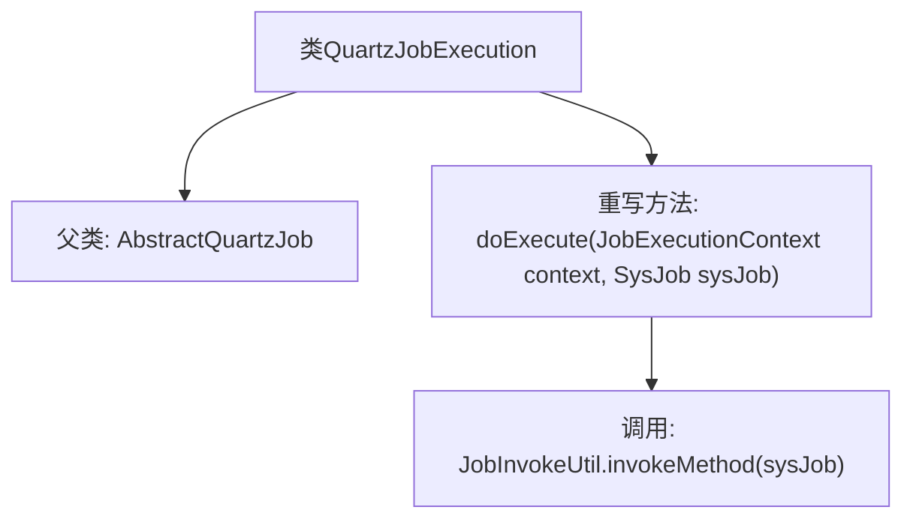

# 基础信息

|      |      |
|------|------|
| 编码语言 | .java |
| 代码路径 | ruoyi-quartz/ruoyi-quartz/src/main/java/com/ruoyi/quartz/util/QuartzJobExecution.java |
| 包名 | com.ruoyi.quartz.util |
| 依赖项 | ['org.quartz.JobExecutionContext', 'com.ruoyi.quartz.domain.SysJob'] |
| 概述说明 | QuartzJobExecution类继承AbstractQuartzJob，重写doExecute调用JobInvokeUtil.invokeMethod。 |

# 说明

QuartzJobExecution类继承自AbstractQuartzJob，并重写了doExecute方法。在重写的方法中，调用了JobInvokeUtil.invokeMethod来实现具体的任务执行逻辑。这一设计使得QuartzJobExecution类能够通过继承和重写的方式，灵活地执行不同的任务，同时利用JobInvokeUtil.invokeMethod来动态调用具体的方法，增强了代码的可扩展性和可维护性。

# 类列表 Class Summary

| 名称   | 类型  | 说明 |
|-------|------|-------------|
| QuartzJobExecution | class | QuartzJobExecution类继承AbstractQuartzJob，重写doExecute方法调用JobInvokeUtil.invokeMethod。 |

## 类 QuartzJobExecution

|      |      |
|------|------|
| 访问范围 | public |
| 类型 | class |
| 名称 | QuartzJobExecution |
| 说明 | QuartzJobExecution类继承AbstractQuartzJob，重写doExecute方法调用JobInvokeUtil.invokeMethod。 |

### UML类图

这段代码展示了 `QuartzJobExecution` 类继承自 `AbstractQuartzJob` 类，并重写了 `doExecute` 方法。`QuartzJobExecution` 类通过调用 `JobInvokeUtil` 的 `invokeMethod` 方法来执行任务。`JobExecutionContext` 和 `SysJob` 类分别提供了任务执行的上下文信息和任务详细信息。整体结构体现了任务执行的流程和依赖关系。

### 内部方法调用关系图

这段代码展示了一个名为 `QuartzJobExecution` 的类，它继承自 `AbstractQuartzJob` 类，并重写了 `doExecute` 方法。在 `doExecute` 方法中，调用了 `JobInvokeUtil.invokeMethod` 方法来执行具体的任务逻辑。流程图清晰地展示了类的继承关系以及方法调用的顺序，帮助理解代码的执行流程。

### 字段列表 Field List

| 名称  | 类型  | 说明 |
|-------|-------|------|

### 方法列表 Method List

| 名称  | 类型  | 说明 |
|-------|-------|------|
| doExecute | void | 重写doExecute方法，调用JobInvokeUtil.invokeMethod执行任务。 |

