# 基础信息

|      |      |
|------|------|
| 编码语言 | .java |
| 代码路径 | ruoyi-quartz/ruoyi-quartz/src/main/java/com/ruoyi/quartz/util/ScheduleUtils.java |
| 包名 | com.ruoyi.quartz.util |
| 依赖项 | ['org.quartz.CronScheduleBuilder', 'org.quartz.CronTrigger', 'org.quartz.Job', 'org.quartz.JobBuilder', 'org.quartz.JobDetail', 'org.quartz.JobKey', 'org.quartz.Scheduler', 'org.quartz.SchedulerException', 'org.quartz.TriggerBuilder', 'org.quartz.TriggerKey', 'com.ruoyi.common.constant.Constants', 'com.ruoyi.common.constant.ScheduleConstants', 'com.ruoyi.common.exception.job.TaskException', 'com.ruoyi.common.exception.job.TaskException.Code', 'com.ruoyi.common.utils.StringUtils', 'com.ruoyi.common.utils.spring.SpringUtils', 'com.ruoyi.quartz.domain.SysJob'] |
| 概述说明 | ScheduleUtils类提供定时任务管理功能，涵盖任务创建、触发策略及白名单检查。 |

# 说明

ScheduleUtils类主要用于管理定时任务，提供任务创建、触发策略设置以及白名单检查等功能，确保任务执行的灵活性和安全性。

# 类列表 Class Summary

| 名称   | 类型  | 说明 |
|-------|------|-------------|
| ScheduleUtils | class | ScheduleUtils类提供定时任务管理功能，包括任务创建、触发策略及白名单检查。 |

## 类 ScheduleUtils

|      |      |
|------|------|
| 访问范围 | public |
| 类型 | class |
| 名称 | ScheduleUtils |
| 说明 | ScheduleUtils类提供定时任务管理功能，包括任务创建、触发策略及白名单检查。 |

### UML类图

```mermaid
classDiagram
    class ScheduleUtils {
        +Class~? extends Job~ getQuartzJobClass(SysJob sysJob)
        +TriggerKey getTriggerKey(Long jobId, String jobGroup)
        +JobKey getJobKey(Long jobId, String jobGroup)
        +void createScheduleJob(Scheduler scheduler, SysJob job) throws SchedulerException, TaskException
        +CronScheduleBuilder handleCronScheduleMisfirePolicy(SysJob job, CronScheduleBuilder cb) throws TaskException
        +boolean whiteList(String invokeTarget)
    }

    class SysJob {
        <<Interface>>
        +String getConcurrent()
        +Long getJobId()
        +String getJobGroup()
        +String getCronExpression()
        +String getMisfirePolicy()
        +String getStatus()
    }

    class Scheduler {
        <<Interface>>
        +boolean checkExists(JobKey jobKey)
        +void deleteJob(JobKey jobKey)
        +void scheduleJob(JobDetail jobDetail, Trigger trigger)
        +void pauseJob(JobKey jobKey)
    }

    class Job {
        <<Interface>>
    }

    class JobDetail {
        +JobDataMap getJobDataMap()
    }

    class Trigger {
        <<Interface>>
    }

    class CronTrigger {
        <<Interface>>
    }

    class JobBuilder {
        +JobBuilder newJob(Class~? extends Job~ jobClass)
        +JobDetail build()
    }

    class TriggerBuilder {
        +TriggerBuilder newTrigger()
        +Trigger build()
    }

    class CronScheduleBuilder {
        +CronScheduleBuilder cronSchedule(String cronExpression)
        +CronScheduleBuilder withMisfireHandlingInstructionIgnoreMisfires()
        +CronScheduleBuilder withMisfireHandlingInstructionFireAndProceed()
        +CronScheduleBuilder withMisfireHandlingInstructionDoNothing()
    }

    class StringUtils {
        <<Interface>>
        +String substringBefore(String str, String separator)
        +int countMatches(String str, String sub)
        +boolean containsAnyIgnoreCase(String str, String searchChars)
        +String[] split(String str, String separator)
    }

    class SpringUtils {
        <<Interface>>
        +Object getBean(String name)
    }

    class Constants {
        <<Interface>>
        +String JOB_WHITELIST_STR
        +String JOB_ERROR_STR
    }

    class TaskException {
        +TaskException(String message, Code code)
    }

    class Code {
        +int CONFIG_ERROR
    }

    ScheduleUtils --> SysJob : 依赖
    ScheduleUtils --> Scheduler : 依赖
    ScheduleUtils --> Job : 依赖
    ScheduleUtils --> JobDetail : 依赖
    ScheduleUtils --> Trigger : 依赖
    ScheduleUtils --> CronTrigger : 依赖
    ScheduleUtils --> JobBuilder : 依赖
    ScheduleUtils --> TriggerBuilder : 依赖
    ScheduleUtils --> CronScheduleBuilder : 依赖
    ScheduleUtils --> StringUtils : 依赖
    ScheduleUtils --> SpringUtils : 依赖
    ScheduleUtils --> Constants : 依赖
    ScheduleUtils --> TaskException : 依赖
    ScheduleUtils --> Code : 依赖
```

### 描述
`ScheduleUtils` 是一个工具类，用于管理和调度定时任务。它提供了创建、暂停、删除定时任务的功能，并处理任务执行时的策略。`ScheduleUtils` 依赖于多个接口和工具类，如 `SysJob`、`Scheduler`、`Job`、`JobDetail`、`Trigger`、`CronTrigger` 等，通过这些依赖来完成定时任务的管理和调度。此外，`ScheduleUtils` 还提供了白名单检查功能，确保任务执行的目标在允许的范围内。

### 内部方法调用关系图

```mermaid
graph TD
    A["类ScheduleUtils"]
    B["方法: getQuartzJobClass(SysJob sysJob)"]
    C["方法: getTriggerKey(Long jobId, String jobGroup)"]
    D["方法: getJobKey(Long jobId, String jobGroup)"]
    E["方法: createScheduleJob(Scheduler scheduler, SysJob job)"]
    F["方法: handleCronScheduleMisfirePolicy(SysJob job, CronScheduleBuilder cb)"]
    G["方法: whiteList(String invokeTarget)"]
    H["内部调用: getQuartzJobClass(job)"]
    I["内部调用: getJobKey(jobId, jobGroup)"]
    J["内部调用: getTriggerKey(jobId, jobGroup)"]
    K["内部调用: handleCronScheduleMisfirePolicy(job, cronScheduleBuilder)"]
    L["内部调用: scheduler.checkExists(getJobKey(jobId, jobGroup))"]
    M["内部调用: scheduler.deleteJob(getJobKey(jobId, jobGroup))"]
    N["内部调用: scheduler.scheduleJob(jobDetail, trigger)"]
    O["内部调用: scheduler.pauseJob(getJobKey(jobId, jobGroup))"]
    P["内部调用: StringUtils.isNotNull(CronUtils.getNextExecution(job.getCronExpression()))"]
    Q["内部调用: SpringUtils.getBean(StringUtils.split(invokeTarget, '.')[0])"]

    A --> B
    A --> C
    A --> D
    A --> E
    A --> F
    A --> G
    E --> H
    E --> I
    E --> J
    E --> K
    E --> L
    E --> M
    E --> N
    E --> O
    E --> P
    G --> Q
```

这段代码是一个用于管理定时任务的工具类，主要功能包括获取Quartz任务类、构建任务触发器和任务键、创建定时任务、处理定时任务策略以及检查包名是否为白名单配置。代码通过调用内部方法实现这些功能，确保任务能够正确调度和管理。

### 字段列表 Field List

| 名称  | 类型  | 说明 |
|-------|-------|------|

### 方法列表 Method List

| 名称  | 类型  | 说明 |
|-------|-------|------|
| getTriggerKey | TriggerKey | 根据任务ID和组名生成触发器键。 |
| getJobKey | JobKey | 根据jobId和jobGroup生成JobKey对象。 |
| getQuartzJobClass | Class<? extends Job> | 根据任务并发性返回相应的Quartz作业类。 |
| createScheduleJob | void | 创建调度任务，构建任务和触发器，检查任务存在性，执行或暂停任务。 |
| whiteList | boolean | 方法检查调用目标是否在白名单中，根据包名和条件判断返回布尔值。 |
| handleCronScheduleMisfirePolicy | CronScheduleBuilder | 根据任务策略处理Cron调度错误，返回相应调度器或抛出异常。 |

