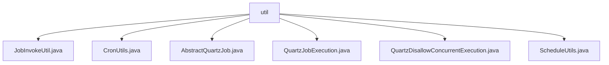

# 基础信息

|      |      |
|------|------|
| 编码语言 | .java |
| 代码路径 | ruoyi-quartz/ruoyi-quartz/src/main/java/com/ruoyi/quartz/util |
| 包名 | ruoyi-quartz.ruoyi-quartz.src.main.java.com.ruoyi.quartz.util |
| 概述说明 | JobInvokeUtil执行系统任务，CronUtils处理Cron表达式，Quartz任务类确保任务不并发，ScheduleUtils管理定时任务。 |

# 说明

JobInvokeUtil类负责解析并调用目标方法及其参数，简化任务执行流程，提高效率和准确性。CronUtils类处理Cron表达式，验证合法性、获取错误信息、查询下次执行时间及近10次执行时间，适用于定时任务管理。抽象类处理Quartz任务，自动记录日志并包含异常处理机制，确保任务透明性和系统稳定性。QuartzJobExecution类继承自AbstractQuartzJob，重写doExecute方法并调用JobInvokeUtil.invokeMethod，增强代码可扩展性和可维护性。Quartz任务类确保任务不并发执行，通过调度器管理任务触发，避免多线程问题。ScheduleUtils类管理定时任务，提供任务创建、触发策略设置及白名单检查，确保任务执行的灵活性和安全性。

### 包内部结构视图

该流程图展示了`ruoyi-quartz`项目中`util`目录下的文件层级关系。`util`作为根节点，包含了多个工具类文件，如`JobInvokeUtil.java`、`CronUtils.java`等。这些文件都与定时任务调度相关，分别用于不同的功能实现，如任务调用、时间表达式解析、任务执行等。

# 文件列表 File List

| 名称   | 类型  | 说明 |
|-------|------|-------------|
| [ScheduleUtils.java](ScheduleUtils.md) | file | ScheduleUtils类提供定时任务管理功能，涵盖任务创建、触发策略及白名单检查。 |
| [QuartzDisallowConcurrentExecution.java](QuartzDisallowConcurrentExecution.md) | file | Quartz任务类禁止并发执行，调用指定方法。 |
| [QuartzJobExecution.java](QuartzJobExecution.md) | file | QuartzJobExecution类继承AbstractQuartzJob，重写doExecute调用JobInvokeUtil.invokeMethod。 |
| [AbstractQuartzJob.java](AbstractQuartzJob.md) | file | 抽象类实现Quartz任务，含执行前后日志及异常处理。 |
| [CronUtils.java](CronUtils.md) | file | CronUtils类支持Cron表达式验证、错误处理及执行时间查询。 |
| [JobInvokeUtil.java](JobInvokeUtil.md) | file | JobInvokeUtil类用于执行系统任务并调用目标方法及参数。 |
| [ScheduleUtils.java](ScheduleUtils.md) | file | ScheduleUtils类提供定时任务管理功能，涵盖任务创建、触发策略及白名单检查。 |
| [QuartzDisallowConcurrentExecution.java](QuartzDisallowConcurrentExecution.md) | file | Quartz任务类禁止并发执行，调用指定方法。 |
| [QuartzJobExecution.java](QuartzJobExecution.md) | file | QuartzJobExecution类继承AbstractQuartzJob，重写doExecute调用JobInvokeUtil.invokeMethod。 |
| [AbstractQuartzJob.java](AbstractQuartzJob.md) | file | 抽象类实现Quartz任务，含执行前后日志及异常处理。 |
| [CronUtils.java](CronUtils.md) | file | CronUtils类支持Cron表达式验证、错误处理及执行时间查询。 |
| [JobInvokeUtil.java](JobInvokeUtil.md) | file | JobInvokeUtil类用于执行系统任务并调用目标方法及参数。 |

